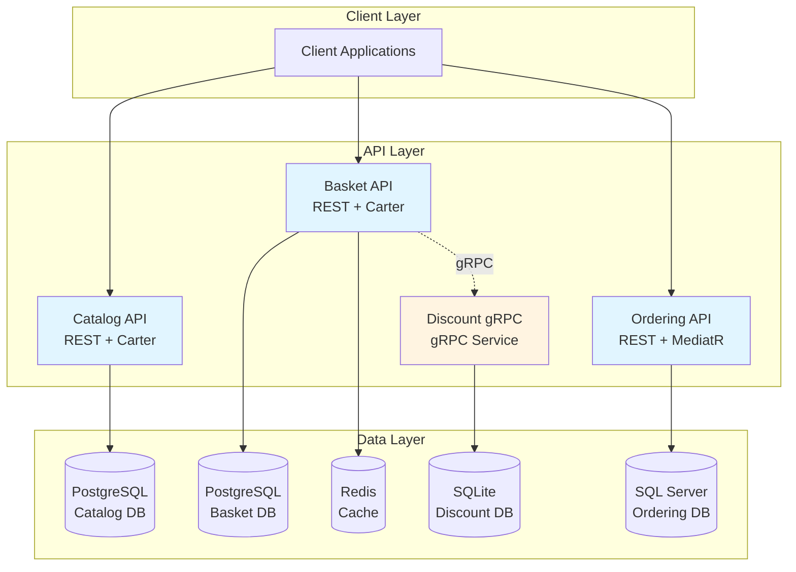

# 🚀 Microservices Learning Repo

<div align="center">


**A comprehensive microservices architecture implementation using .NET and modern cloud-native patterns**

[Features](#-features) • [Architecture](#-architecture) • [Getting Started](#-getting-started) • [Services](#-services) • [Contributing](#-contributing)

</div>

---

## 📖 About

This repository follows my personal journey learning **Microservices with .NET**. Starting from simple Minimal APIs and growing into a distributed system with best practices and modern patterns.

> 💡 **Work in progress** — contributions, suggestions, and learning tips welcome!

## ✨ Features

- ✅ **Independent Microservices** - Catalog, Basket, Discount, and Ordering services
- ✅ **Multiple Communication Patterns** - REST APIs and gRPC
- ✅ **Database per Service** - PostgreSQL, Redis, SQLite
- ✅ **Container-First** - Full Docker & Docker Compose support
- 🚧 **Async Messaging** - RabbitMQ / Azure Service Bus (Coming Soon)
- 🚧 **API Gateway** - Service discovery and routing (Coming Soon)
- 🚧 **CI/CD Pipeline** - GitHub Actions (Coming Soon)
- 🚧 **Observability** - Logging, metrics, and tracing (Coming Soon)

## 🏗️ Architecture



### Architecture Highlights

- **Catalog Service**: Product catalog management with PostgreSQL and Marten (Event Store)
- **Basket Service**: Shopping cart with Redis caching and gRPC integration
- **Discount Service**: Discount management via gRPC for inter-service communication
- **Ordering Service**: Order processing using Clean Architecture (DDD)

## 🛠️ Technology Stack

### Backend
- **.NET 8** - Modern web framework
- **Carter** - Minimal API routing
- **MediatR** - CQRS pattern implementation
- **FluentValidation** - Input validation
- **Mapster** - Object mapping

### Databases
- **PostgreSQL** - Primary database for Catalog and Basket
- **Marten** - Document DB and Event Store on PostgreSQL
- **Redis** - Distributed caching
- **SQLite** - Lightweight DB for Discount service

### Communication
- **gRPC** - High-performance RPC framework
- **REST** - Standard HTTP APIs

### DevOps
- **Docker** - Containerization
- **Docker Compose** - Multi-container orchestration

## 🚀 Getting Started

### Prerequisites

- [.NET 8 SDK](https://dotnet.microsoft.com/download/dotnet/8.0)
- [Docker Desktop](https://www.docker.com/products/docker-desktop)
- [Git](https://git-scm.com/)

### Quick Start with Docker

1. **Clone the repository**
   ```bash
   git clone https://github.com/AlyaariHazem/Microservices.git
   cd Microservices
   ```

2. **Start all services using Docker Compose**
   ```bash
   docker-compose up -d
   ```

3. **Access the services**
   - **Catalog API**: http://localhost:5000/swagger
   - **Basket API**: http://localhost:6001/swagger
   - **Discount gRPC**: http://localhost:6002

4. **Stop all services**
   ```bash
   docker-compose down
   ```

### Running Individual Services

#### Catalog API
```bash
cd src/Services/Catalog/Catalog.API
dotnet run
```

#### Basket API
```bash
cd Basket.API
dotnet run
```

#### Discount gRPC
```bash
cd src/Services/Discount/Discount.Grpc
dotnet run
```

#### Ordering API
```bash
cd src/Services/Ordering/Ordering.API
dotnet run
```

## 📦 Services

### 🛍️ Catalog Service
**Port**: 5000 (HTTP), 5050 (HTTPS)

The Catalog service manages the product catalog with full CRUD operations.

**Technologies**:
- Carter for Minimal API routing
- Marten for document database and event sourcing
- PostgreSQL for persistence
- MediatR for CQRS pattern
- FluentValidation for request validation

**Key Features**:
- Product management (Create, Read, Update, Delete)
- Product listing with pagination
- Category-based filtering
- Event sourcing capabilities

### 🛒 Basket Service
**Port**: 6001 (HTTP), 6061 (HTTPS)

The Basket service handles shopping cart operations with caching and discount integration.

**Technologies**:
- Carter for Minimal API routing
- PostgreSQL for persistence
- Redis for distributed caching
- gRPC client for Discount service integration
- MediatR for CQRS pattern

**Key Features**:
- Shopping cart management
- Redis caching for performance
- Integration with Discount service via gRPC
- Automatic discount application

### 💰 Discount Service (gRPC)
**Port**: 6002 (HTTP), 6062 (HTTPS)

The Discount service provides discount information via gRPC protocol.

**Technologies**:
- gRPC server
- SQLite for lightweight storage
- Entity Framework Core

**Key Features**:
- Discount management
- High-performance gRPC communication
- Product-specific discounts
- Inter-service communication

### 📋 Ordering Service
**Port**: 7000 (HTTP), 7050 (HTTPS) *(Coming Soon)*

The Ordering service manages order processing using Clean Architecture principles.

**Technologies**:
- Clean Architecture (Domain, Application, Infrastructure layers)
- MediatR for CQRS
- Domain-Driven Design patterns
- Entity Framework Core

**Key Features**:
- Order creation and management
- Clean Architecture implementation
- Domain-driven design
- CQRS pattern

## 📂 Project Structure

```
Microservices/
├── src/
│   └── Services/
│       ├── Catalog/
│       │   └── Catalog.API/          # Product catalog service
│       ├── Discount/
│       │   └── Discount.Grpc/        # gRPC discount service
│       └── Ordering/
│           ├── Ordering.API/         # Order management API
│           ├── Ordering.Application/ # Application layer (CQRS)
│           ├── Ordering.Domain/      # Domain models
│           └── Ordering.Infrastructure/ # Data access
├── Basket.API/                       # Shopping basket service
├── BuildingBlocks/                   # Shared libraries
├── docker-compose.yml                # Docker services definition
├── docker-compose.override.yml       # Development overrides
└── README.md
```

## 🔗 API Endpoints

### Catalog API
- `GET /products` - Get all products
- `GET /products/{id}` - Get product by ID
- `GET /products/category/{category}` - Get products by category
- `POST /products` - Create new product
- `PUT /products` - Update product
- `DELETE /products/{id}` - Delete product

### Basket API
- `GET /basket/{username}` - Get user's basket
- `POST /basket` - Create/Update basket
- `DELETE /basket/{username}` - Delete basket
- `POST /basket/checkout` - Checkout basket

### Discount gRPC
- `GetDiscount` - Get discount for a product
- `CreateDiscount` - Create new discount
- `UpdateDiscount` - Update existing discount
- `DeleteDiscount` - Delete discount

## 🐳 Docker Compose Services

| Service | Container | Port | Description |
|---------|-----------|------|-------------|
| catalog.api | catalogapi | 5000, 5050 | Catalog REST API |
| basket.api | basketapi | 6001, 6061 | Basket REST API |
| discount.grpc | discountgrpc | 6002, 6062 | Discount gRPC Service |
| catalogdb | catalogdb | 5432 | PostgreSQL for Catalog |
| basketdb | basketdb | 5433 | PostgreSQL for Basket |
| distributedcache | distributedcache | 6379 | Redis Cache |

## 🧪 Testing

```bash
# Run all tests
dotnet test

# Run tests for specific service
cd src/Services/Catalog/Catalog.API
dotnet test
```

## 📚 Learning Resources

This project implements various microservices patterns and practices:

- **CQRS** (Command Query Responsibility Segregation)
- **Repository Pattern**
- **Minimal APIs** with Carter
- **Clean Architecture**
- **Domain-Driven Design**
- **Event Sourcing** with Marten
- **gRPC Communication**
- **Containerization**
- **Database per Service**

## 🤝 Contributing

Contributions are welcome! This is a learning repository, so feel free to:

1. Fork the repository
2. Create a feature branch (`git checkout -b feature/amazing-feature`)
3. Commit your changes (`git commit -m 'Add some amazing feature'`)
4. Push to the branch (`git push origin feature/amazing-feature`)
5. Open a Pull Request

## 📝 License

This project is licensed under the MIT License - see the [LICENSE](LICENSE) file for details.

## 📧 Contact

Hazem Alyaari - [@AlyaariHazem](https://github.com/AlyaariHazem)

Project Link: [https://github.com/AlyaariHazem/Microservices](https://github.com/AlyaariHazem/Microservices)

---

<div align="center">

**⭐ Star this repository if you find it helpful!**

Made with ❤️ for learning Microservices

</div>
